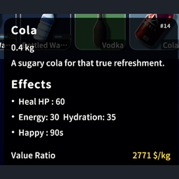

# cost per weight

shows $/kg in the item tooltip so you can tell at a glance whether something's worth carrying. color-coded to match the game's value tiers (white through red).



## building

you need the [.NET SDK](https://dotnet.microsoft.com/download) and Escape from Duckov installed locally (the build references DLLs from the game).

```sh
dotnet build CostPerWeight/CostPerWeight.csproj -c Release
```

if your game's in a non-default Steam location, update `DuckovPath` in `CostPerWeight/CostPerWeight.csproj`.

## installing

drop `CostPerWeight.dll`, `info.ini`, and `preview.png` into your mods folder:

- mac: `Duckov.app/Contents/Mods/CostPerWeight/`
- windows: `Duckov_Data/Mods/CostPerWeight/`

enable it from the main menu.

## based on

[DisplayItemValue](https://github.com/xvrsl/duckov_modding) for the tooltip pattern, [ItemLevelAndSearchSoundMod](https://github.com/dzj0821/ItemLevelAndSearchSoundMod) for the color tiers. works with both.
